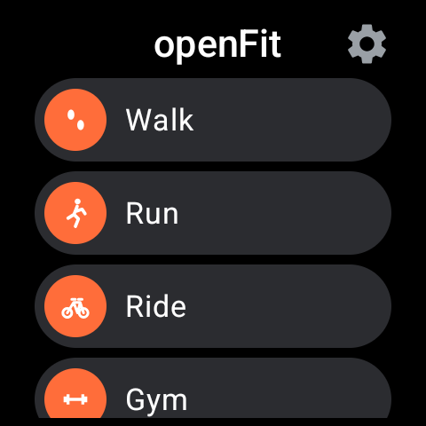
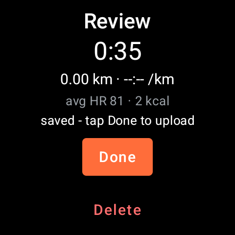

# openFit

A Strava-free fitness-tracking stack you own end to end: a **Wear OS watch app** that records
activities straight from the wrist, and an optional **Android phone app** that keeps a local
library with maps. Activities are written as standard **TCX** files and uploaded to **your own
server** — built for [Dreeve](https://github.com/robiningelbrecht/statistics-for-strava), but any
endpoint that accepts a TCX upload works the same way.





## Features

**Watch app (`:wearApp`, Wear OS 3+)**
- Records **Walk, Run, Ride, Gym, Pool swim** through Wear Health Services (GPS, heart rate,
  distance, calories, laps/strokes where applicable).
- **Review gate** — when you stop, the activity is saved locally and *nothing leaves the watch*
  until you tap **Done** (or **Delete** with an explicit confirm step). Files stay queued forever
  until then; uploads are retry-safe (servers that de-duplicate by content can be re-sent freely).
- **Auto-pause** (where the hardware supports it): pauses when you stop moving, resumes when you
  move again; manual pause always requires a manual resume. Rules and research: `docs/design/auto-pause.md`.
- **Live stats** on three swipeable pages — big metrics, session stats, live route sketch — plus a
  **Lap** button, per-km/mile splits, and **haptics** for start / split / lap / pause / resume.
- **Ongoing-activity chip**: while recording, a small icon sits on the watch face (tap to return)
  and the notification shade carries the live stats with pause/stop actions.
- **Settings** on the watch: **Sync now** (drain the upload queue), **Units** (metric/imperial,
  display-only — files always stay metric), **Auto-pause** on/off.
- Round-screen-safe icon controls; works standalone (no phone required) over Wi-Fi/LTE.

## Phone app (`:phoneApp`, optional)

The phone app is a **companion for your Dreeve instance**: it shows your own dashboard, activities,
segments, best efforts, heatmap, Eddington, milestones, monthly stats, rewind, badges and gear —
each as its own screen — plus the parts a browser can't do: the upload queue for activities the watch
handed over, server configuration, and offline route maps.

It renders **your own Dreeve pages** inside the app (so every stat, chart and map behaves exactly as on
your server, including features added in future Dreeve releases) with Dreeve's own chrome hidden and the
app's native navigation in its place. No extra server component, no cloud service.

- Configurable **server URL + API key** with a **Test connection** button (`GET /api/v1/status`)
- **Sync** tab: upload queue, per-item status, manual sync, local list + OpenStreetMap route view
- **GPX export** of any activity (saved to Downloads from the activity screen)
- Appearance: system / light / dark — applied to the embedded pages too
- Works with any Dreeve instance; only `example.com`-style placeholders in this repo

Technical notes for contributors live in `docs/design/phone-app.md`.

## Requirements
- A Wear OS 3+ watch (developed on Wear OS 6). Heart rate requires the usual sensor permissions —
  the app requests them on first launch.
- A server that accepts a `multipart/form-data` TCX upload (Dreeve: `POST /api/v1/activity/upload`
  with a `drv_…` Bearer key — see its Admin → Settings → Security).
- To build: JDK 17 + Android SDK 34 (`ANDROID_HOME` or `local.properties` with `sdk.dir`).

## Build
```bash
git clone https://github.com/<you>/openFit.git && cd openFit
./gradlew :wearApp:assembleDebug :phoneApp:assembleDebug
```
APKs land in `wearApp/build/outputs/apk/debug/` and `phoneApp/build/outputs/apk/debug/`.

## Install
**Watch** — enable Developer options (Settings → About → tap *Software version* 5×), turn on
**ADB debugging** + **Wireless debugging**, then from a computer:
```bash
adb pair <watch-ip>:<pair-port>      # once — type the code shown on the watch
adb connect <watch-ip>:<port>        # port shown on the Wireless debugging screen
adb install -r wearApp-debug.apk
```
Debug ports change on every re-enable — re-check the watch's screen. Detailed recipes, including
dump-driven headless workflows and the gotchas that come with them, are in `docs/testing.md`.

**Phone** — `adb install -r phoneApp-debug.apk`, or open the APK on the phone.

## Configure
Everything points at **your** server — there are no baked-in defaults and no third-party service.

**Phone app:** open it, fill in **Server URL** (e.g. `https://stats.example.com`) and **API key**,
tap **Save**.

**Watch app:** the watch uploads directly, so it needs the same two values:
```bash
scripts/configure-watch.sh https://stats.example.com <API_KEY> [device-serial]
```
This writes the config into the app's private prefs via `run-as` (debug builds only). Afterwards,
**Settings → Sync now** on the watch drains any pending uploads.
> An in-app configuration screen on the watch is on the roadmap — today the script is the supported path.

## How it works
- **Watch**: Health Services exercise session → TCX v2 (`TcxWriter`) → local file queue
  (`files/activities/`) → direct HTTPS upload (`DreeveUploader`, OkHttp). If the direct upload
  fails, the file is offered to the phone over the Wearable Data Layer instead. Nothing is deleted
  implicitly, ever.
- **Phone**: listens for incoming files, stores them, uploads on demand, renders maps from the
  recorded track.
- **Design docs**: `docs/design/auto-pause.md` (auto-pause rules + platform capability findings),
  `docs/design/metrics-provenance.md` (where every number comes from),
  `docs/design/strava-gap-analysis.md` (feature comparison + deliberate omissions).

## Privacy
Recording happens on the watch; files are written locally and uploaded **only** to the URL you
configure. No analytics, no ads, no third-party services. Screenshots in `docs/screens/` show
generic test values.

## Roadmap
See `docs/ROADMAP.md`. Near-term: in-app watch configuration, TCX lap splits, elevation/cadence
rows, HR zones, treadmill profile.

## Contributing
PRs welcome — see `CONTRIBUTING.md`.

## License
MIT — see `LICENSE`.
